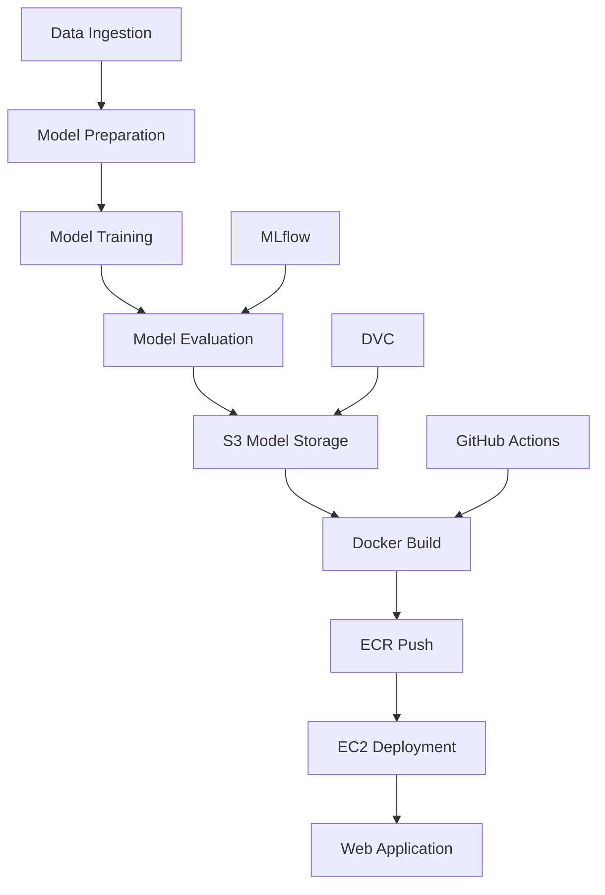

# 🫁 End-to-End Chest Cancer Classification

[](https://www.python.org/downloads/)
[](https://pytorch.org/)
[](https://mlflow.org/)
[](https://aws.amazon.com/)
[](https://www.docker.com/)
[](https://dvc.org/)

http://35.91.236.2:8080/

A production-ready MLOps pipeline for Non-Small Cell Lung Cancer (NSCLC) classification using deep learning. This project implements an end-to-end workflow from data ingestion to model deployment with automated CI/CD, model versioning, and cloud-based inference.

## Project Overview

This system classifies chest CT scan images into four NSCLC categories:
- **Adenocarcinoma** (left lower lobe, T2 N0 M0 Ib)
- **Large Cell Carcinoma** (left hilum, T2 N2 M0 IIIa) 
- **Normal** (healthy tissue)
- **Squamous Cell Carcinoma** (left hilum, T1 N2 M0 IIIa)

### Architecture



## Key Features

### 🚀 **MLOps Pipeline**
- **Automated Training**: Complete pipeline from data ingestion to model evaluation
- **Model Versioning**: DVC integration for model version control
- **Experiment Tracking**: MLflow for metrics and model management
- **Cloud Storage**: Automatic model upload to AWS S3

### 🐳 **Containerized Deployment**
- **Lightweight Docker Images**: Models stored on S3, not in containers
- **Automated CI/CD**: GitHub Actions for build, test, and deployment
- **Cloud Infrastructure**: AWS EC2 + ECR + S3 integration

### 🌐 **Web Application**
- **Flask API**: RESTful endpoints for predictions
- **Real-time Inference**: Upload images and get instant classifications
- **S3 Model Loading**: Dynamic model downloading from cloud storage

## 🛠️ Technology Stack

| Component | Technology |
|-----------|------------|
| **Deep Learning** | PyTorch, PyTorch Lightning |
| **MLOps** | MLflow, DVC |
| **Web Framework** | Flask |
| **Containerization** | Docker |
| **Cloud Platform** | AWS (S3, EC2, ECR) |
| **CI/CD** | GitHub Actions |
| **Model Versioning** | DVC + S3 |
| **Monitoring** | MLflow Tracking |

## 📁 Project Structure

```
├── .github/workflows/     # CI/CD pipelines
├── config/               # Configuration files
├── src/cvClassifier/     # Main package
│   ├── components/       # Core components
│   ├── pipeline/         # Training & prediction pipelines
│   └── utils/           # Utility functions
├── templates/           # Web UI templates
├── research/           # Jupyter notebooks
├── artifacts/          # Generated artifacts
├── app.py             # Flask web application
├── main.py            # Training pipeline entry point
├── dvc.yaml           # DVC pipeline definition
├── Dockerfile         # Container configuration
└── requirements.txt   # Python dependencies
```

## Quick Start

You can visit the hosted classifier at http://35.91.236.2:8080/
For training and implementing the project locally, follow these steps"

### Prerequisites
- Python 3.8+
- Docker
- AWS Account (for S3 storage)
- Git
- Mlflow

### 1. Clone Repository
```bash
git clone https://github.com/your-username/End-to-end-chest-cancer-classification.git
cd End-to-end-chest-cancer-classification
```

### 2. Setup Environment
```bash
# Create virtual environment
python -m venv venv
source venv/bin/activate  # On Windows: venv\Scripts\activate

# Install dependencies
pip install -r requirements.txt
```

### 3. Configure AWS and add to Github secrets
```bash
AWS_ACCESS_KEY_ID= ***
AWS_SECRET_ACCESS_KEY= ***
AWS_REGION= ***
AWS_ECR_LOGIN_URI= ***
ECR_REPOSITORY_NAME= ***
```

### 4. Run Training Pipeline and deploy model to S3 bucket
```bash
dvc repro
```

## MLOps Workflow

### Training Pipeline
1. **Data Ingestion**: Download and prepare dataset
2. **Model Preparation**: Setup model architecture
3. **Model Training**: Train using PyTorch Lightning
4. **Model Evaluation**: Validate and log metrics to MLflow
5. **S3 Upload**: Automatically push trained model to S3
6. **DVC Tracking**: Version control model artifacts

### Deployment Pipeline
1. **GitHub Actions Trigger**: On code push to main
2. **Docker Build**: Create lightweight container (no model)
3. **ECR Push**: Upload image to AWS ECR
4. **EC2 Deployment**: Deploy container to EC2 instance
5. **Model Loading**: Download latest model from S3 at runtime

## Docker Deployment

### Build Image
```bash
docker build -t chest-cancer-classifier .
```

### Run Container
```bash
docker run -p 8080:8080 \
  -e AWS_ACCESS_KEY_ID=your_key \
  -e AWS_SECRET_ACCESS_KEY=your_secret \
  -e S3_MODEL_BUCKET=your_bucket \
  chest-cancer-classifier
```

### Key Benefits
- ✅ **56MB smaller images** (model stored on S3)
- ✅ **Faster deployments** (no model in container)
- ✅ **Dynamic model updates** (no container rebuilds)
- ✅ **Scalable architecture** (shared model storage)


### Example Usage


## Configuration

### Environment Variables
| Variable | Description | Default |
|----------|-------------|----------|
| `AWS_ACCESS_KEY_ID` | AWS access key | Required |
| `AWS_SECRET_ACCESS_KEY` | AWS secret key | Required |
| `AWS_REGION` | AWS region | `us-west-2` |
| `S3_MODEL_BUCKET` | S3 bucket for models | Required |

### Model Configuration
- **Image Size**: 224x224 pixels
- **Architecture**: Custom CNN with PyTorch
- **Training**: PyTorch Lightning with MLflow tracking
- **Storage**: AWS S3 with DVC versioning

## Monitoring & Logging

### MLflow Tracking
- **Metrics**: Accuracy, loss, precision, recall
- **Parameters**: Learning rate, batch size, epochs
- **Artifacts**: Model files, training plots
- **Models**: Registered model versions

### Application Logs
- **Training**: Comprehensive pipeline logging
- **Inference**: Request/response logging
- **Errors**: Detailed error tracking

## 🚀 CI/CD Pipeline

### GitHub Actions Workflow
1. **Training**: Run ML pipeline (optional)
2. **Model Upload**: Push to S3 via DVC
3. **Docker Build**: Create container image
4. **ECR Push**: Upload to AWS ECR
5. **Deployment**: Deploy to EC2 instance

### Automated Features
- ✅ **Model versioning** with DVC
- ✅ **Automated testing** on pull requests
- ✅ **Zero-downtime deployments**
- ✅ **Rollback capabilities**

## License

This project is licensed under the MIT License - see the [LICENSE](LICENSE) file for details.

## Acknowledgments

- **Dataset**: Chest Cancer Image Dataset
- **Framework**: PyTorch Lightning for training
- **MLOps**: MLflow for experiment tracking
- **Deployment**: AWS cloud infrastructure
- **Versioning**: DVC for model management


